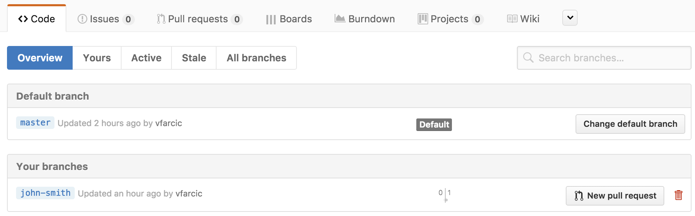

# Source Code Management

Imagine a developer relentlessly writing code. He is working on his laptop trying to add new features. Once he's done, he'll convert that code to an actual application. Easy, isn't it? Well, it's not easy to write code, but the process seems simple. You can compare a developer to a book writer. Both write some text and package it once they're done. Developer's product is an application while writer's end result is a book. Now imagine that we split book writing among many writers. It could be five, ten, or even a hundred writers. To make it more complicated, they all work in parallel. How would we split their work? We could give each writer one of the characters from the book. Others might write descriptions of the environments those characters are in. And so on and so forth. What would happen if each of those writers is writing on their own laptop? We would probably end up with a huge mess. Imagine that we are talking about a massive book. Something of a size of War and Peace by Tolstoy. Combining their own individually written texts would be close to impossible.

While novels are not written but an army of writers, we cannot say the same for software. In almost all cases, coders (people who write software code) work in teams. They write lines of code that needs to work in perfect unison with other lines of code written by other coders. A single mistake could prevent that code from becoming software. How do developers accomplish such a division of work? One of the answers lies in source code management tools and the processes behind them.

Let's start from the beginning. What is source code?

## Source Code

**Source code is a text listing of commands to be compiled or assembled into an executable computer program.**

Let's try a more descriptive explanation.

We'll take a save button in, let's say, Power Point as an example. When you click it, it will overwrite the previous version of your presentation. If previous version does not exist, you will be presented with a dialog that let's you write the name of the file. The code behind such a functionality could be as follows.

```
when save_button is clicked then
  if existing_file exists then
    write to existing_file
  else
    request new_file
    write to new_file
```

Please note that was not a real code. The objective of this text is not to teach you how to program. However, even though the code is fake, it is written using a similar structure programmers would use. When an event is created (clicking a button), execute some business logic (whether the file exists of not), and perform some actions (save the file). Writing code is, in a way, similar to writing novels. There are rules to be followed and a story to be told. Both require a deep understanding of the rules behind a language as well as a certain level of creativity. A misplaced exclamation mark will change the meaning of a sentence in the same way as a misplaced `if` statement will change the meaning of the code. The major difference is that novelists use the same language as us, while programmers tend to use languages only they understand.

Now that it is a bit clearer what the code is, let us discuss code repositories.

## Source Code Repository

**A source code repository is a file archive and hosting facility where a large amount of source code is kept, either publicly or privately.**

There you go. That was another cryptic sentence understood only by those who already know what a code repository is.

In most cases, multiple developers work on the same application or, to be more precise, on the code of the same application. Sometimes they write the code in separate files, while, at other times, they might be modifying even the same file as other team members. There can be tens, or even hundreds of developers working on the same source code.

Naturally, if many people are working on the same set of files, there must be a way to share their work. Each developer should be able to share what they wrote with others and vice versa.

In a way, source code repository serves a similar function as Google Docs does for documents. You can choose to edit a file from your browser. In that case, changes you do would be merged with the changes done by other people working on the same document. On the other hand, you might choose to download the latest version of a document, make some changes on your laptop and, once you're done, upload the modified document to Google Docs. In such a scenario, the version you upload will overwrite the document wrote by someone else becoming a new version. You can also choose to see the history of a document that would show you all the changes made by you or any other person that has access to it.

## Tools

Developers use a similar approach. The major difference is that their tools are more sophisticated and allow much bigger control of the files stored in a source code repository.

**Some of the most popular tools used as source code repository are [Concurrent Versions System (CVS)](http://www.nongnu.org/cvs/), [Subversion (SVN)](https://subversion.apache.org/), and [Git](https://git-scm.com/).**

While there are significant technical differences between those tools, the all serve the same purpose. Developers use them to store (check-in) their code, retrieve the code wrote by others, create new branches (new copies), merge the changes they made with those created by others, create versions (snapshots), and so on.

The important thing to understand is that CVS is old. It might be older than you. No one chooses it any more. However, since companies invest a lot of effort into their tools, it is still present in quite a few, usually bigger, organizations. SVN is in a similar situation. While it's newer than CVS and is arguably much better, it is also considered old and is rarely a choice any more. Many companies switched from CVS to SVN so it's presence is much greater. The real ruler is Git. It was created in 2005 and is the most common choice as a tool to manage source code. Almost all new projects are using Git. Many organizations are in the process of changing their CVS and SVN repositories to Git.

Git is only one piece of the puzzle. It is the core technology behind other solutions. Most teams choose to use one of the solutions built on top of Git. Such solutions provide additional value by providing graphical user interface (GUI), authentication, and quite a few other additional features. Some of the most commonly used solutions are [GitHub.com](https://github.com/), [BitBucket](https://bitbucket.org/), and [GitLab](https://gitlab.com). All three of them can be used as a service or be hosted on your own servers.

Please install [Git](https://git-scm.com/). We'll do a few simple exercises with the aim of getting a better understanding of how source code repositories work. Don't worry. It won't be any thing complicated. The idea is not to convert you into a Git expert but only to give you the minimum understanding of the utility of the tool.

## Pulling or checking-out the code

Let's say that you are a new developer. You joined the team and they already filled your head with all the technical and functional aspects of the application you will help them develop.

The first thing you want to do as a newcomer is to check-out the code. Since the team is using Git, the correct terminology is *clone*. You will clone the remote repository. As the result, all the code hosted in the Git server will be downloaded to your laptop.

Please open your terminal and run the command that follows.

```bash
git clone https://github.com/vfarcic/fake-repo.git
```

The whole repository is downloaded to your laptop. You can see the files by opening the `dev-for-dummies` directory. Inside it is a directory called `source` with the file `dummy-code.md`. Open it in your favourite editor (Notepad should do if you are a Windows user). You will see a text similar to the one that follows.

```
Imagine that this is not a text but a real code.

This spectacular piece of text was written by Viktor Farcic.
```

Please note that the content of the `dummy-code.md` file might be different. It's a code repository and other might have changed it.

Now you are almost ready to write some code.

## Branching

Let's say that you want to start working on a new feature. On one hand, you want to use the code repository as often as possible. The more often you check-in the code, the less chance that something will be lost if your laptop gets destroyed or stolen. On the other hand, you don't want your half-finished work to affect others.

Developers often work in branches. A branch is a copy of all the files. In most cases, the master branch is "golden". It's a place where finished code is merged to. All others are usually called feature branches. They are temporary copies of the main branch. We use them as a place where we keep our half-finished code.

You are currently working in the master branch. Let's create a new one. Please type the commands that follow in your terminal window. Replace `john-smith` with your real name. Don't use space characters (developers do not like that).

```bash
cd fake-repo

git branch john-smith
```

To give you a better idea of what happened, let's list all the available branches.

```bash
git branch
```

The output is as follows.

```
  john-smith
* master
```

As you can see, the newly created branch `john-smith` is listed. Please notice the asterisk (`*`) next to the `master` branch. It means that, even though you created the new branch, the active one is still  `master`.

Let's switch to the newly created branch.

```bash
git checkout john-smith

git branch
```

The output of the `git branch` command is now slightly different.

```bash
* john-smith
  master
```

As you can see, the asterisk (`*`) is now at `john-smith` confirming that we switched to the newly created branch. Any change to the files we might make will not affect those in `master`. You have your own copy of the repository.

Finally, we should push the new branch to the remote repository so that others are able to see the result of our work.

```bash
git push --set-upstream origin john-smith
```

Now we are ready to do some fake-coding.

## Committing or checking-in

Let's simulate coding activities by changing the contents of the `source/dummy-code.md` file. Please open it in your favourite editor and change something. As an example, the file currently has words `Viktor Farcic`. I'll change them to `John Smith`. Don't forget to save the changes before proceeding.

We can see the changes by executing the command that follows.

```bash
git diff
```

The relevant part of the output is as follows.

```
-This spectacular piece of text was written by Viktor Farcic.

+This spectacular piece of text was written by John Smith.
```

Git tells us that there was a line ending with `Viktor Farcic` and that it was replaced with the line ending with `John Smith`.

This will be, by all means, a magnificent contribution to the project. Let's store the changes in the repository before something bad happens to our laptop. Better safe than sorry.

```bash
git commit -a -m "I changed the name"

git push
```

The first command (`git commit`) commited all the changed files. Git commit is equivalent to making a snapshot of the current state of the code. We also added a message (`-m`) so that others can easily deduce the scope of the changes introduced in this commit.

Further on, we pushed the code to repository. From now on, every other member of the team that has the access to the repository, can review the changes we made.

Let's confirm that the branch and the changes we made are indeed pushed to the remote repository. Please open the repository in the GitHub UI. It is located in [https://github.com/vfarcic/fake-repo](https://github.com/vfarcic/fake-repo). Click the "Branches" link and observe that the branch you created is listed.



Feel free to experiment. Modify some of the files or create new ones. Commit and push the changes to the remote repository and observe them from the UI. Once you're done, we'll proceed to the next stage. We'll merge our change with the `master` branch.

## Merge

In most cases, teams consider a feature ready for deployment when it is merged into the `master` branch. Developers would write code and commit it to a branch they created and, once they are finished, merge it to `master`. From that moment on, the code is ready to move through a pipeline that will test it, build it, and run it in production. Actually, SDSLC is more complicated than that but we'll get there soon. For now, think of the `master` branch as a place where we put the finished code.

First things first. We want to switch back to the `master` branch and pull the latest code from the remote repository.

```bash
git checkout master

git pull
```

We used the `checkout` command to switch to the `master` branch. That was followed with the `pull` command that updated our local copy with the code stored remotely.

Now we can merge

```bash
git merge john-smith
```

The `merge` commmand combined the changes done in the `john-smith` branch with those in the `master`. If there was a conflict, Git would let us know.

The output is as follows.

```
Updating bc6fc30..ddfb6be
Fast-forward
 source/dummy-code.md | 2 +-
 1 file changed, 1 insertion(+), 1 deletion(-)
```

We can see that one file changed, that one line was inserted and one was deleted.

The merge currently exists only on the laptop. We should push it to the remote repository and make it available to others.

```bash
git push origin master
```

We can confirm that the merge was indeed pushed from the GitHub UI. Please open the [fake-repo](https://github.com/vfarcic/fake-repo) repository, select the `source` directory and open the `dummy-code.md` file. You will see that its content changed.

## Summary

That was a very short introduction to source code and repositories. It was just enough for you to have a general understanding what the code is and how it is managed inside the repositories.

Source code is a text listing of commands to be compiled or assembled into an executable computer program.

A source code repository is a file archive and hosting facility where a large amount of source code is kept, either publicly or privately.

Some of the most popular tools used as source code repository are [Concurrent Versions System (CVS)](http://www.nongnu.org/cvs/), [Subversion (SVN)](https://subversion.apache.org/), and [Git](https://git-scm.com/).

We use pulling (or checking-out) to get the latest code locally, branching to create copies that allow us to work independently from others, committing and pushing to propagate our changes to the remote location, and, finally, merging to combine our changes with those made by others. The `master` branch is the *golden* source that is a reflection of the code deployed to production. All other branches are, in most cases, temporary places where we keep our code until it's merged to the `master`.